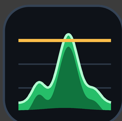
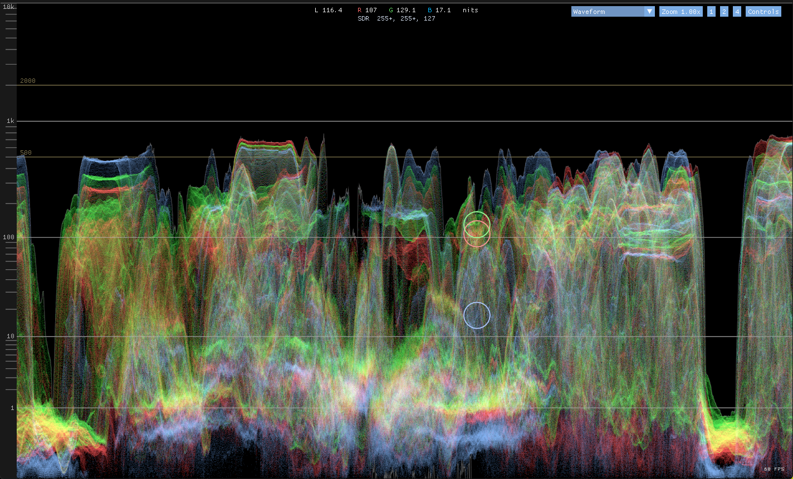
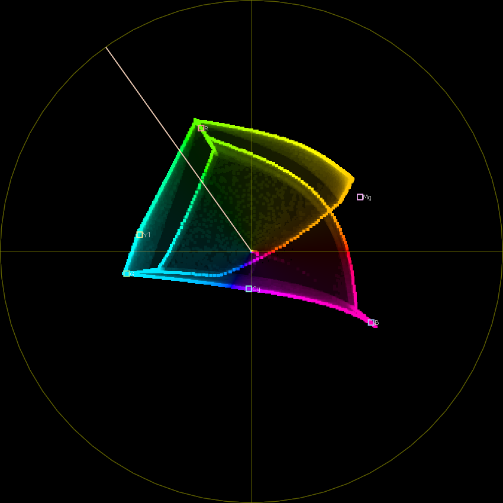
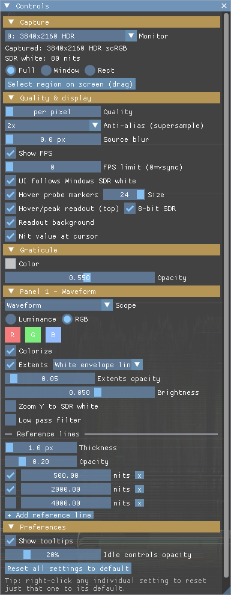

# HDRScopes

**Real-time video scopes for the live Windows HDR signal.**
Waveform · Histogram · Vectorscope · CIE Chromaticity — reading the actual
scRGB FP16 pixels Windows composites to your display.

[](https://github.com/Shadetail/HDRScopes/releases/latest)
[](LICENSE)
[](https://github.com/Shadetail/HDRScopes/actions/workflows/build.yml)

Traditional scopes live inside an NLE and only see that app's own timeline.
HDRScopes instead captures the Windows desktop itself (DXGI Desktop
Duplication, scRGB FP16 — the real composited HDR signal), so it can measure
what nothing else can: games, video players, YouTube in a browser, your own
code, another grading app such as Unreal Engine or Lightroom / Adobe Camera
Raw, or simply the desktop as a whole. If Windows draws it in HDR, HDRScopes
can put it on a scope — live, at ~110 FPS for a 4K capture.

<!-- HERO SHOT (Mario): full window, waveform on pretty HDR content with
     specular peaks punching above a reference line. Save as docs/img/hero.png
     and uncomment:
<p align="center"></p>
-->

## Scopes



- **Waveform** — per-column PQ-nit histogram over a fixed 0–10,000 nit log
  axis. Luminance or RGB mode, optional colorize, extents display (colored
  points or a supersampled 1-px envelope line), draggable custom reference
  lines, and an SDR-white vertical-zoom mode that pins the axis top to the
  current Windows SDR-white level.
- **Histogram** — pixel count per nit bin: stacked L/R/G/B bands, overlaid
  RGB, or luma only.
- **Vectorscope** — Y′CbCr chroma in your choice of PQ (HDR, absolute-nits)
  or Rec.709 (SDR) encoding, with 75%/100% primary/secondary targets and a
  skin-tone line *(pictured: a BT.2020 saturation sweep)*.
- **CIE Chromaticity** — 1931 xy or 1976 u′v′, with the spectral locus,
  Rec.709 / P3 / Rec.2020 gamut triangles, and the D65 white point.

Layouts: single scope, 2-up, or 4-up, each panel with its own scope choice and
settings. Hover any pixel of the captured screen and each scope marks where
that pixel lands (white = luminance, R/G/B circles), with a nit readout at the
cursor.

## Download

Grab the latest zip from **[Releases](https://github.com/Shadetail/HDRScopes/releases/latest)**,
unzip anywhere, run `HDRScopes.exe`. No installer, no dependencies, no
telemetry. Fully portable: settings persist to a plain-text `settings.ini`
next to the exe, so deleting the folder removes every trace, and separate
copies of the app can keep separate setups. (If the folder isn't writable —
e.g. Program Files — settings fall back to `%LOCALAPPDATA%\HDRScopes`.)

**Requirements:** Windows 10 (1809+) or Windows 11 · any DX11-capable GPU ·
HDR or SDR output. SDR signals (an SDR desktop, or SDR content on an HDR
desktop — same thing to the capture) are read the HDR-compatible way, as the
0–80-nit reference range, and the scopes fully support working there: the
waveform supports an SDR-white zoom, the hover readout shows 8-bit SDR
values, and the vectorscope supports Rec.709 (SDR) encoding. The one thing
missing is SDR-relative nit labels on the graticules — ask in Issues if you
need that.

## Usage



- **Controls** (top-right button) opens the settings popup: capture source
  (monitor / window / dragged screen region), quality, and per-panel scope
  options. Rest the mouse on any control for an explanation (tooltips can be
  turned off under Preferences); right-click any control to reset just it.
- **Layouts** — the `1 / 2 / 4` buttons switch layout presets; each panel has
  a scope picker.
- **Navigate** — mouse-wheel zoom (to cursor), middle-drag pan, click the
  bottom-left zoom readout to reset.
- **Reference lines** — add draggable horizontal nit markers on the waveform
  (log-scaled drag, `Shift` = finer).
- **Quality** — presets from Low to Per-pixel trade bin-grid and sample
  density for speed; optional bilinear source downsample suppresses
  nearest-sampling noise; optional FPS limiter.
- The UI is drawn at the Windows SDR-white brightness on HDR outputs, while
  the scope traces keep their true HDR nit values.

## Known limitations

- No parade scope yet, as I never personally found it useful — but I can add
  it if someone wants it.
- The vectorscope skin-tone line follows the classic "I-line" convention, for
  which no exact standard exists — tools disagree slightly on its angle, so
  ours is configurable (skin tones of all complexions naturally cluster along
  this line, varying in saturation far more than in hue).
- RGB undershoots below 0 nits clamp to the bottom of the waveform rather
  than rendering below the 0-line.
- DRM-protected content (Netflix and friends) captures as black — that's
  Windows working as intended, not a bug.

## Building from source

Visual Studio 2022 (or Build Tools) + CMake:

```powershell
cmake -S . -B build -G "Visual Studio 17 2022" -A x64
cmake --build build --config Release
```

Output: `build/Release/HDRScopes.exe` (static CRT, fully self-contained).
Shaders compile at runtime, so `.hlsl` edits apply on relaunch with no
rebuild. Architecture notes live in [docs/ARCHITECTURE.md](docs/ARCHITECTURE.md).

## License & credits

GPLv3 — see [LICENSE](LICENSE). Third-party components are MIT-licensed; see
[THIRD_PARTY_NOTICES.md](THIRD_PARTY_NOTICES.md).

- Color-space conversion HLSL adapted from
  [SKIV](https://github.com/SpecialKO/SKIV) by Andon "Kaldaien" Coleman and
  Aemony (MIT) — thank you.
- UI built on [Dear ImGui](https://github.com/ocornut/imgui) (MIT).
- Scope behavior is modeled on the industry-standard scopes in DaVinci
  Resolve and validated against them where possible.
- Developed in close AI pair-programming with Anthropic's Claude — the scope
  design, color-science decisions, and validation are human.

## Support

Bug reports and feature requests are welcome in
[Issues](https://github.com/Shadetail/HDRScopes/issues) — this is a hobby
project, so support is best-effort. If HDRScopes is useful to you, a star
helps others find it, and sponsorship (button up top) is appreciated but
never expected.
